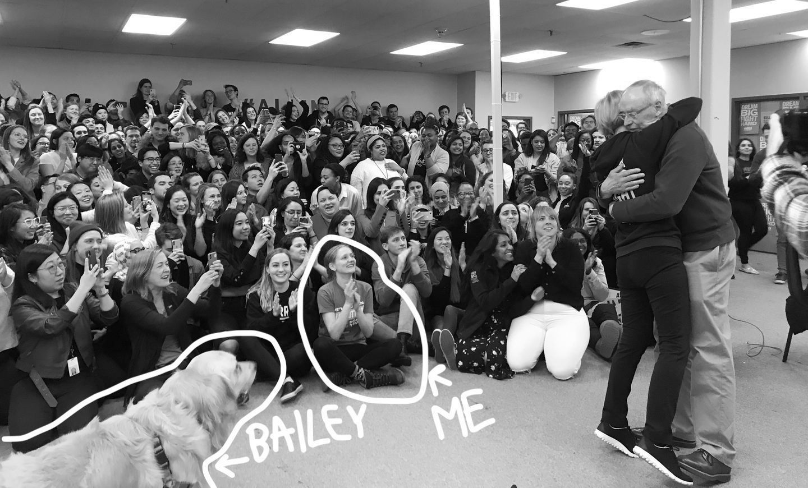

_Hi, I'm Nina._ :wave:

I have 10 years of experience in the tech industry and I've worked as a product manager for Elizabeth Warren's tech team, a successful Silicon Valley startup, and Microsoft. You can see examples of my work on [campaign tech](), [data](), and [tools for people who write code]().

_Photo by Jess Bidgood, Boston Globe, March 2020_

:sparkles: :sparkles: **You can work with me!** :sparkles: :sparkles:
I'm especially interested in working with early-stage companies dedicated to building a more equitable society, economy, and democracy. I'm available for consulting/contract work on a few select projects. If you're looking for help validating product ideas, building out your product and engineering teams, or making a plan to launch that new feature, [let's get in touch](mailto:nina@vyed.in).

You can find me on [keybase](https://keybase.io/vyedin), [github](https://github.com/vyedin), [linkedin](https://www.linkedin.com/in/vyedin/), and occasionally [twitter](https://twitter.com/vyedin). My resume is [here](nina-resume-2021_2.pdf).
