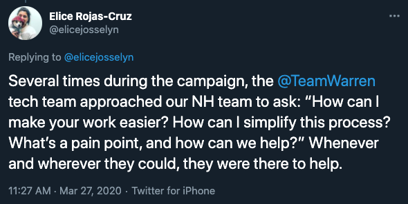

I joined the Warren campaign in June 2020 as the first product manager, focusing on organizing technology. Much of what my team built was open sourced after the campaign, and you can find a good summary of that effort on [Wired](https://www.wired.com/story/elizabeth-warren-campaign-open-source-tech/) and [Medium](https://medium.com/@teamwarren/open-source-tools-from-the-warren-for-president-tech-team-f1f27d2c7551).

 

  

 

Our campaign tech team was a phenomenal group of individuals. To hear their stories, check out [this episode of DevTalk podcast](https://kerry.lothrop.de/devtalk-41/) we recorded with my friend Kerry Lothrop after the campaign, and [this wonderful post](https://medium.com/@susangoldblatt/tech-on-a-presidential-campaign-an-overview-9679d69b2109) by one of our engineers. You can find other campaign projects on the Team Warren [Github](https://github.com/Elizabeth-Warren).

 

 

---

### Switchboard: Organize Your Community

Switchboard was a tool for distributed organizing. It's my favorite of all the projects I worked on, and both the [front-end](https://github.com/Elizabeth-Warren/supportal-frontend) and [backend](https://github.com/Elizabeth-Warren/supportal-backend) are open source!

 

<iframe width="560" height="315" src="https://www.youtube.com/embed/FVrbVGFsK_s" frameborder="0" allow="accelerometer; autoplay; clipboard-write; encrypted-media; gyroscope; picture-in-picture" allowfullscreen></iframe>

 

When I first joined the campaign, I was told we had several hundred thousand volunteer prospects who had filled out an interest form online but had not yet heard back from the campaign. This was both urgent and inevitable: it was critical that we connected with supporters as soon as possible and put them to work, but we didn't have the staff we needed in every state to organize everyone. To solve this, we needed to make everyone an organizer by empowering volunteers to connect with other Warren supporters in their communities. Switchboard was our solution to that.

We sent our best and most trusted volunteers to Switchboard, a web app where they could discover, connect, and keep track of prospects in their area. We replaced the traditional model, where an organizer has to cut lists of prospects for volunteers to call, with a simple algorithm that repeatedly assigned volunteers their ten closest contacts. Volunteers would call or text their prospects and if they made a connection, they could sign the prospect up for an event and add them to their list for future contacts. 

The app was beautiful, simple, and easy to use. We used a passwordless login flow (we didn't want to be in the business of doing password resets!), and volunteers could shift their prospects into Mobilize America events directly from the app. I personally used Switchboard almost daily to recruit for debate watch parties, phone banks, and canvasses in my town. Thousands of volunteer prospects got their first outreach from the campaign via Switchboard, and our volunteers loved it!

Collaborators: [@jjandoc](https://github.com/jjandoc), [@goldblatt](https://github.com/goldblatt), [@matteosb](https://github.com/matteosb), [@victoriaadams](https://twitter.com/victoriadams) and many many more!

---

### Shifter: Never Miss a Volunteer Shift

Shifter was a tool that allowed us to collect event signups on our own front-ends and write them to Mobilize America (our event management tool) using the Mobilize API. We created a mirror of our Mobilize events database that we synced periodically, writing new signups from our front-ends to Mobilize while refreshing our data to have the most recent events from Mobilize. This allowed us to capture event signups wherever we wanted.

Shifter powered in-app event signups on Switchboard (above), as well as on our website. Becasue of Shifter, we were able to build a beautiful personalized signup journey where visitors could select how they wanted to help and we would recommend events based on their location (and the campaign's priorities in that location). Shifter also acted as a failsafe to capture and cache event signups when Mobilize went down.

 

 

A Shifter widget was integrated directly into the call script in ThruTalk. This meant that a volunteer calling to recruit for an event on the mass-contact calling tool could sign up the people they were calling for a Mobilize event directly from the call script by submitting a form with the person's data pre-filled and the shift time selected. 

This is important because before Shifter, callers would mark the person they were calling as "interested in attending" in a survey question, relying on the callee to remember to attend the event (!!!). With Shifter, the callee received email reminders from Mobilize, and the success of our recruitment efforts could be tracked and measured. Shifter helped us capture thousands of volunteer shifts that would otherwise have been lost.

Collaborators:  [@goldblatt](https://github.com/goldblatt), [@jjandoc](https://github.com/jjandoc), [@victoriaadams](https://twitter.com/victoriadams), [@matteosb](https://github.com/matteosb), and many more.

---

### Iowa Caucus App

 

 

Our Iowa team wanted a mobile app to help precinct captains (~2500 Warren volunteers) navigate caucus math. The app was for internal campaign use only and had three major requirements: 

1. Get the caucus math right
2. Work offline
3. Send results of calculations back to the campaign

We put together a proposal for a design and a recommendation to try building this as a progressive web app, with the caveat that the technology was still new and would require the Iowa team to be an active participant in building and testing. This choice had some big benefits - there was no app store review process or separate packages to maintain, volunteers didn't have to remember Apple or Google passwords (a real issue), and once the app was pinned to the home screen, it looked and felt just like a native app. We wrote results to DynamoDB (S3 for pictures of paper caucus worksheets, which proved crucial) and then to a master spreadsheet where analysts compiled results. 

After some initial issues (service workers failed to update the app in certain scenarios, and we had to track down those users to clear their cache), our app and the accompanying support hotline worked well on caucus night, and even won us some delegates!

 

 

 

Caucuses are a [developer's nightmare](https://www.nytimes.com/2020/02/09/us/politics/iowa-democratic-caucuses.html), with niche requirements and little opportunity to test technology ahead of time. That said, we found our infrastructure held up remarkably well. We gave ourselves a generous timeline (~6mo) for the project, we built on extensive feedback from colleagues who had used apps in previous caucuses, and we incorporated failsafes like the support hotline to help catch and fix issues before the contest. You can browse the source code for our app [here](https://github.com/Elizabeth-Warren/iowa-caucus-app).

In the end, we were able to share our raw data with the Iowa Democratic party to speed up results:

 

  

 

Collaborators: [@jjandoc](https://github.com/jjandoc), [@goldblatt](https://github.com/goldblatt), [@benweissmann](https://benweissmann.com/), [@victoriaadams](https://twitter.com/victoriadams), [@charlotteeffect](https://twitter.com/charlotteeffect), and many others.

---

### Dialers, Hotlines, and other fun with telephony

I spent a lot of cycles on the campaign learning everything I could about telephony. This included researching the possibility of building our own dialer for massive call campaigns (we eventually decided [ThruTalk](https://www.thrutalk.io/)/Livevox was the most cost-effective option for us), finding ways to improve call connection rate with caller ID and whitelisting, and building call and text flows for various initiatives. Thanks to some clever ideas from [@benweissmann](https://benweissmann.com/) and a Twilio developer account, I once found myself "in charge" of a small army of Verizon phones that would all ring at the same time. I have zero regrets about the whole thing.

