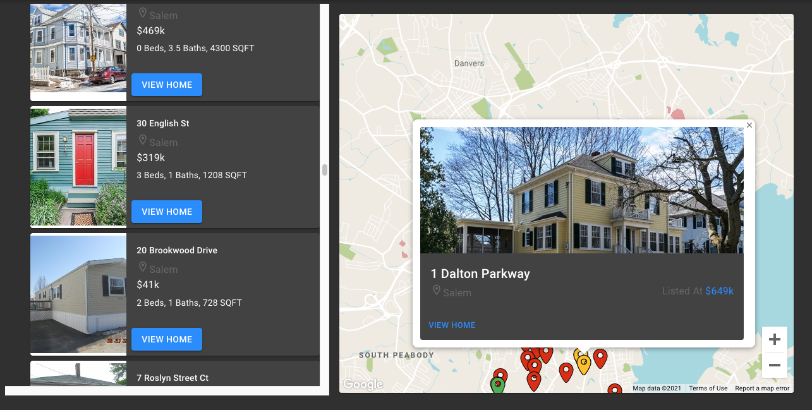

I love working with data and am working towards a certificate in data science from Harvard's extension school program. Here are a few examples of 

#### The Modal Voter: GenData 2020 Final Project

For my final project as part of the [Generation Data](https://www.generationdata.org/) Intro to Progressive Data training, I applied statistical methods I learned in one of my favorite Planet Money episodes ("[The Modal American](https://www.npr.org/2019/08/28/755191639/episode-936-the-modal-american)") to our mock campaign data. I wrote SQL queries to break voters into demographic "buckets" based on generation, party, sex, and race, and then used Tableau to visualize patterns of voter behavior. This was chosen as one of 6 top projects out of 20.

[]

#### Classifying Building Types: Image Classification for Colloquial Architecture

 

 
<iframe width="560" height="315" src="https://www.youtube.com/embed/4UlEgA22lpE" frameborder="0" allow="accelerometer; autoplay; clipboard-write; encrypted-media; gyroscope; picture-in-picture" allowfullscreen></iframe>

#### Flipper: Real Estate Classifier

Flipper was a final group project for a course I took with [Zona Kostic](https://www.zonakostic.com/about.html) in summer 2020. My team had access to a subset of Greater Boston MLS (real estate) data from the past 10 years. Our goal was to determine whether a property had flip potential _without_ using listing photos or descriptions, and discern which predictors contributed most to a given listing's flippability. This was a classic data science problem - no deep learning required. I owned the data science portion of the project and used a random forest classifier, training the model on past flips we found in the listings augmented with SMOTE to create a more balanced data set. You can browse the full notebook [here](https://github.com/gregfrasco/real-estate-price-predictions/blob/master/notebooks/basic_model.ipynb).

Getting the model to make accurate predictions using listing metadata was a challenge, but we were able to classify non-flippable properties with ~98% accuracy and classify flippable properties with just under 70% accuracy. Our team was the runner up for best final project with the Flipper model and site.

Collaborators: [@gregfrasco](https://github.com/gregfrasco) and [@goudete](https://github.com/goudete).
