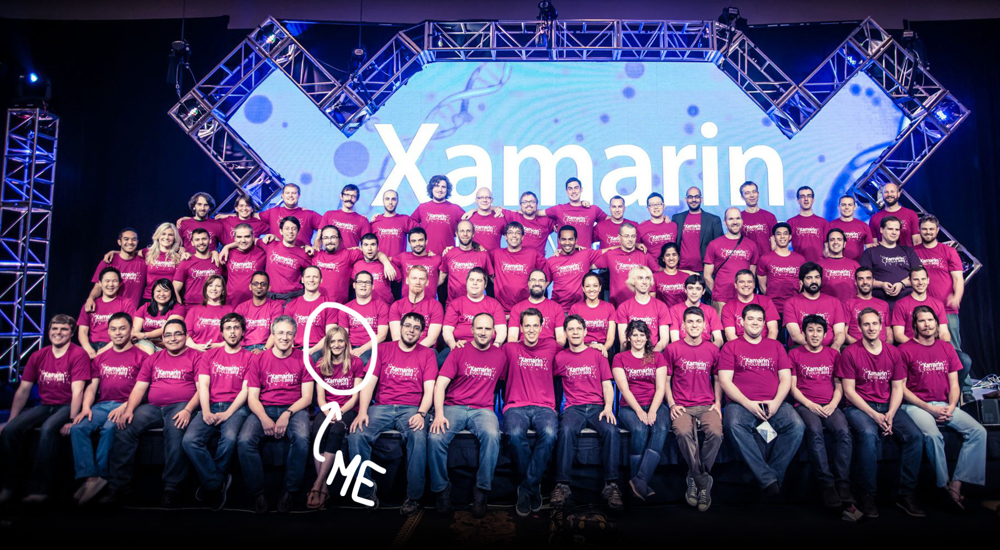

In 2011, I joined a new startup []. We joined Microsoft in 2016 []. Below are some of the projects I'm most proud of.

 

 

---

### Evolve 2016: Keynote, Live Previewer, and the state of mobile

For our 2016 Evolve conference, I []. [blog post announcement]. 

 

<iframe width="560" height="315" src="https://www.youtube.com/embed/jgXCB51e4ak?start=1800" frameborder="0" allow="accelerometer; autoplay; clipboard-write; encrypted-media; gyroscope; picture-in-picture" allowfullscreen></iframe>

 

 

I was offered an hour to give any talk I wanted at the conference, and produced a short documentary on everyday people's relationships with their mobile apps and devices. It's an celebration of the way mobile has changed our lives since the first smartphone came out, and a look back on the market and the company we helped build.

It's called "If You Build It", and you can watch it here:

 

<iframe src="https://vimeo.com/album/3937948/embed" width={playback_width} height={playback_height} allowfullscreen frameborder="0"></iframe>

 

---

### Evolve 2014: Profiler

My first big project as a product manager was building a profiler for managed code to help Xamarin developers find and fix performance issues in their apps.  Watch me break down the product and why it's useful with my friend [@JamesMontemagno](https://twitter.com/JamesMontemagno) on Channel 9 or read the announcement blog post [here](https://devblogs.microsoft.com/xamarin/say-hello-to-the-xamarin-profiler/).

 

<iframe width="560" height="315" src="https://www.youtube.com/embed/gO2YwTtJuvs" frameborder="0" allow="accelerometer; autoplay; clipboard-write; encrypted-media; gyroscope; picture-in-picture" allowfullscreen></iframe>

 

---

### Microsoft: Installer, Visual Studio, and more

[msft photo]

At Microsoft, I led the team that modernized the [Visual Studio for Mac installer](https://www.youtube.com/watch?v=KMXm43LVNeY&ab_channel=ProgrammingKnowledge). We upgraded the then 8-year-old codebase from xwt to a native Mac app (using Xamarin.Mac), improved install success by ~20% by rethinking first run experience and making downloads more resilient, and completed a full rebranding. 

I also contributed code to Visual Studio 2019 and Microsoft's [Mobile OpenJDK](https://docs.microsoft.com/en-us/xamarin/android/get-started/installation/openjdk). 
